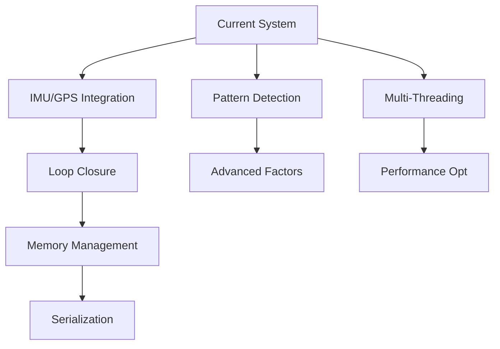

# ConeSTELLATION Future Development TODO List

## Overview
This document contains the prioritized list of features and improvements to be implemented in ConeSTELLATION. All listed items are NOT yet implemented as of 2025-07-21.

### Architecture Update (2025-07-21)
Based on GLIM investigation, we've clarified our hybrid architecture:
- **External Odometry**: IMU+GPS EKF at 100Hz (already available)
- **SLAM**: Focus on landmark mapping and drift correction only
- **Key Insight**: GLIM uses fixed-lag smoother for IMU odometry, not landmark SLAM

## Priority Levels
- 🔴 **HIGH**: Critical for production use or significant performance improvement
- 🟡 **MEDIUM**: Important enhancements that improve system robustness
- 🟢 **LOW**: Nice-to-have features or minor improvements

---

## 🔴 HIGH Priority Tasks

### 1. External Odometry Integration with IMU Preintegration and GPS Factors
**Goal**: Integrate IMU preintegration and RTK GPS factors following GLIM architecture

**Technical Details**:
- **IMU Preintegration** (following GTSAM/GLIM approach):
  - Buffer high-rate IMU data (200-400Hz)
  - Preintegrate between keyframes to create single IMU factor
  - Handle bias estimation and propagation
  - Implement on-manifold integration for SO(3)
  
- **RTK GPS Factor Implementation**:
  - Create GPS position factor with proper covariance
  - Handle GPS/IMU lever arm calibration
  - Implement outlier rejection for GPS jumps
  - Support both absolute and relative GPS constraints

- **Simulation Requirements**:
  - Realistic IMU noise model (white noise + bias random walk)
  - RTK GPS simulation with multipath and outages
  - Synchronization jitter simulation
  - Ground truth generation for validation

**Dependencies**: GTSAM IMU preintegration module

**Implementation Steps**:
1. Implement detailed IMU simulator with realistic noise characteristics
2. Create RTK GPS simulator with accuracy modes (Fix/Float/Single)
3. Integrate GTSAM's IMU preintegration classes
4. Add GPS factor with adaptive weighting based on fix quality
5. Test with various motion profiles and sensor failure scenarios

### 2. ⚠️ Loop Closure Detection (PARTIALLY IMPLEMENTED 2025-07-22)
**Goal**: Detect revisited locations and correct accumulated drift

**Current Implementation**:
- ✅ `LoopClosureDetector` class with constellation descriptors
- ✅ Histogram features for fast matching (distance, angle, color)
- ✅ RANSAC-based relative pose estimation
- ✅ Integration with `ConeMapping` for automatic loop detection
- ✅ Configuration parameters in YAML

**Critical Limitations**:
- ❌ **Not suitable for sparse landmarks** (requires 5+ cones per constellation)
- ❌ **No GPS factor integration** for absolute position constraints
- ❌ **No trajectory-based loop detection** using odometry paths
- ❌ **Ground truth TF dependency** instead of real odometry
- ❌ **Untested in realistic scenarios**

**Required Improvements**:
1. **GPS Factor Integration**
   - Create GPS factor class
   - Add GPS noise models
   - Synchronize with keyframes
   
2. **Trajectory-based Loop Detection**
   - Store path segments with keyframes
   - Implement curve matching algorithms
   - Use odometry accumulation for loop detection
   
3. **Sparse Environment Adaptation**
   - Reduce min_cones_per_constellation to 3
   - Add line-based descriptors
   - Implement partial constellation matching

**Dependencies**: GPS integration, real odometry processing

**Next Steps**: See `loop_closure_sparse_environment_analysis.md` for detailed plan

### 3. ~~Fixed-Lag Smoother Implementation~~ (POSTPONED)
**Status**: Postponed based on GLIM architecture analysis

**Reasoning**:
- GLIM uses fixed-lag smoother ONLY for IMU odometry, not landmark SLAM
- Since we have external odometry, this is not needed
- Landmark SLAM should remain unbounded for maximum accuracy
- May revisit if memory becomes an issue in very long operations

**Alternative**: Consider periodic landmark pruning if needed

---

## 🟡 MEDIUM Priority Tasks

### 4. Pattern Detection for Advanced Factors
**Goal**: Automatically detect and utilize geometric patterns in cone layouts

**Technical Details**:
- **Line Detection**: RANSAC-based fitting for straight sections
  - Create ConeLineFactor for detected lines
  - Handle both left and right track boundaries
- **Curve Detection**: Fit circular arcs or splines
  - Adaptive factor weights based on curvature
- **Parallel Lines**: Detect and maintain track width
  - Create ConeParallelLinesFactor

**Dependencies**: Basic inter-landmark factors working

**Implementation Steps**:
1. Implement RANSAC line fitting in ConePreprocessor
2. Add curve detection using least-squares circle fitting
3. Create pattern-to-factor mapping logic
4. Test on various track geometries

### 5. Multi-Threading Architecture
**Goal**: Achieve real-time performance with parallel processing

**Technical Details**:
- Separate threads for:
  - Sensor data reception
  - Preprocessing and pattern detection
  - Odometry estimation
  - Mapping and optimization
  - Visualization
- Use lock-free queues for inter-thread communication
- Implement proper synchronization

**Dependencies**: Stable single-threaded implementation

**Reference**: GLIM's multi-threading design

### 6. Robust Data Association Improvements
**Goal**: Handle challenging scenarios with occlusions and misclassifications

**Technical Details**:
- Implement Joint Compatibility Branch and Bound (JCBB)
- Add probabilistic data association
- Handle multiple hypotheses for ambiguous cases
- Improve track ID scoring with temporal consistency

**Dependencies**: Current data association working

---

## 🟢 LOW Priority Tasks

### 7. Enhanced Path Visualization
**Goal**: Better debugging and system understanding through visualization

**Technical Details**:
- Separate visualization of:
  - Raw odometry path (with drift)
  - Optimized SLAM path
  - Uncertainty ellipses
- Path color-coding by:
  - Velocity
  - Optimization confidence
  - Time
- Interactive path exploration in RViz

**Dependencies**: Basic visualization working

### 8. Sparse Rigid Body Inter-Landmark Constraints
**Goal**: Create robust landmark clusters that maintain rigid geometric relationships

**Technical Details**:
- **Sparse Constraint Creation Strategy**:
  - Only create inter-landmark factors when ≥5 cones visible in single observation
  - Implement cooldown timer (minimum 1 second between factor creation)
  - Select representative subset of landmarks for constraint creation
  - Create complete graph within selected subset (rigid body)
  
- **Rigid Body Behavior**:
  - Landmarks connected by inter-landmark factors move as rigid unit
  - Use stronger noise model for inter-landmark constraints (σ = 0.01m)
  - Implement factor strength based on co-observation count
  - Prevent over-constraining by limiting total inter-landmark factors
  
- **Implementation Strategy**:
  ```cpp
  // Pseudocode for sparse constraint creation
  if (visible_cones >= 5 && time_since_last > 1.0) {
    selected = select_best_constrained_subset(visible_landmarks, 5);
    for (i in selected) {
      for (j in selected where j > i) {
        create_strong_distance_factor(i, j, sigma=0.01);
      }
    }
    last_constraint_time = current_time;
  }
  ```

**Benefits**:
- Reduces computational load
- Creates stable landmark "anchors"
- Prevents drift in well-observed areas
- Maintains track geometry in curves

**Dependencies**: Basic inter-landmark factors working

### 9. Performance Optimizations
**Goal**: Optimize for embedded deployment

**Technical Details**:
- Profile and optimize hot paths
- Implement sparse matrix optimizations
- Consider GPU acceleration for:
  - Pattern detection
  - Data association
  - Matrix operations
- Memory pool allocation for real-time guarantees

**Dependencies**: Feature-complete system

### 10. Serialization and Recovery
**Goal**: Save/load SLAM state for multi-session mapping

**Technical Details**:
- Serialize factor graph state
- Save landmark database
- Implement map merging from multiple sessions
- Handle version compatibility

**Dependencies**: Stable factor graph structure

---

## Task Dependencies Graph



---

## Testing Strategy for Each Task

### Unit Tests Required
- IMU preintegration accuracy
- Pattern detection robustness
- Loop closure descriptor matching
- Factor Jacobian verification

### Integration Tests Required
- Multi-sensor time synchronization
- Thread safety and race conditions
- Memory usage under long operation
- Loop closure convergence

### Performance Benchmarks
- Processing time per frame
- Memory usage over time
- Optimization convergence speed
- Pattern detection accuracy

---

## Success Metrics

| Feature | Target Metric |
|---------|--------------|
| IMU/GPS Integration | < 5ms latency, < 1% drift |
| Loop Closure | > 95% detection rate, < 1% false positive |
| Pattern Detection | > 90% line detection accuracy |
| Multi-Threading | > 50 Hz update rate |
| Memory Usage | < 1GB for 1-hour operation |

---

## Notes
- Review and update priorities quarterly
- Consider user feedback for priority adjustments
- Some tasks may reveal additional subtasks during implementation
- Keep this document synchronized with GitHub issues/projects